# AI Product Discovery Engine — Architecture

**Organization:** Blinkit  
**Document Type:** Solution Architecture Specification  
**Version:** 1.0  
**Last Updated:** July 2026  
**Sources:** `problemStatement.md`, `context.md`

---

## Document Purpose

This document defines the **technical architecture** for the Blinkit AI Product Discovery Engine—a system that ingests multi-source user feedback, retrieves relevant evidence, synthesizes insights via Google Gemini, validates output quality, and delivers actionable intelligence to business stakeholders.

It follows an **enterprise layered architecture** pattern: separation of concerns, explicit boundaries, auditability, and operational readiness.

---

## 1. Goals

### 1.1 Business Goals

| ID | Goal | Success Indicator |
|----|------|-------------------|
| BG-1 | Explain why MAC users repeat purchases in narrow categories | RQ1 answers backed by ≥2 source types |
| BG-2 | Identify barriers to category exploration | Barrier maps with severity and journey stage |
| BG-3 | Map how users discover products (in-app and out-of-app) | Discovery pathway maps with channel attribution |
| BG-4 | Surface frustrations blocking trial and repeat in new categories | Frustration clusters with sentiment intensity |
| BG-5 | Profile segments that experiment vs. those that don't | Segment exploration profiles with confidence |
| BG-6 | Produce root-cause narratives across psychology, UX, merchandising, market | Root-cause trees with cross-source validation |
| BG-7 | Generate prioritized business opportunities | Opportunity backlog ranked by impact tier |
| BG-8 | Support north-star metric narrative (new category adoption among MAC) | Monthly report links qualitative "why" to metric movement |

### 1.2 Architectural Goals

| ID | Goal | Rationale |
|----|------|-----------|
| AG-1 | **Modularity** | Ingestion, storage, retrieval, generation, and presentation are independently deployable |
| AG-2 | **Provenance & auditability** | Every insight traceable to source document IDs and original quotes |
| AG-3 | **Cross-source synthesis** | System design enforces triangulation, not siloed per-source reports |
| AG-4 | **Quality gates** | Validation layer blocks ungrounded or non-compliant outputs |
| AG-5 | **Scalable ingestion** | Handle growing review volume and periodic Reddit/Form batch loads |
| AG-6 | **Cost efficiency** | Retrieval-first design minimizes tokens sent to Gemini |
| AG-7 | **Security & compliance** | Secrets isolated; PII redacted; role-based dashboard access |
| AG-8 | **Operational observability** | Metrics, logs, and traces across pipeline stages |

### 1.3 Non-Goals (Architecture Boundary)

- Real-time in-app personalization or recommendation serving
- Order-level analytics, MAC computation, or warehouse ETL
- Campaign execution, CRM delivery, or UX deployment
- Proprietary competitor scraping beyond user-voice mentions

---

## 2. Logical Layers

The system is organized into **six logical layers**. Each layer communicates through well-defined interfaces; no layer skips validation or provenance requirements.

```
┌─────────────────────────────────────────────────────────────────────────┐
│  L6  Presentation Layer          Dashboard, exports, API for stakeholders│
├─────────────────────────────────────────────────────────────────────────┤
│  L5  Intelligence Layer          Insight Generator, report composer      │
├─────────────────────────────────────────────────────────────────────────┤
│  L4  AI Orchestration Layer      Prompt Builder, Gemini Integration      │
├─────────────────────────────────────────────────────────────────────────┤
│  L3  Knowledge Access Layer      Retrieval Layer (semantic + metadata) │
├─────────────────────────────────────────────────────────────────────────┤
│  L2  Data Layer                  Review Repository, taxonomy, indexes  │
├─────────────────────────────────────────────────────────────────────────┤
│  L1  Ingestion Layer             Connectors, normalization, enrichment │
└─────────────────────────────────────────────────────────────────────────┘
         ▲                              │
         │                              ▼
   External Sources              Validation Layer (cross-cutting)
   Play · App Store · Reddit · Forms
```

### Layer Responsibilities

| Layer | Components | Responsibility |
|-------|------------|----------------|
| **L1 — Ingestion** | Review Ingestion Service, connectors, schedulers | Acquire, normalize, deduplicate, enrich raw feedback |
| **L2 — Data** | Review Repository, taxonomy store, embedding index metadata | Persist canonical documents, tags, vectors, lineage |
| **L3 — Knowledge Access** | Retrieval Layer | Fetch relevant evidence by RQ, theme, segment, category, recency |
| **L4 — AI Orchestration** | Prompt Builder, Gemini Integration | Assemble grounded prompts; invoke model; parse structured responses |
| **L5 — Intelligence** | Insight Generator, report composer | Transform model output into business artifacts (cards, profiles, backlog) |
| **L6 — Presentation** | Dashboard Layer, export API | Visualize insights; enable search, filter, drill-down to source |
| **Cross-cutting** | Validation Layer | Schema, grounding, confidence, and policy checks at ingestion and generation |

---

## 3. High-Level Architecture

### 3.1 System Context Diagram

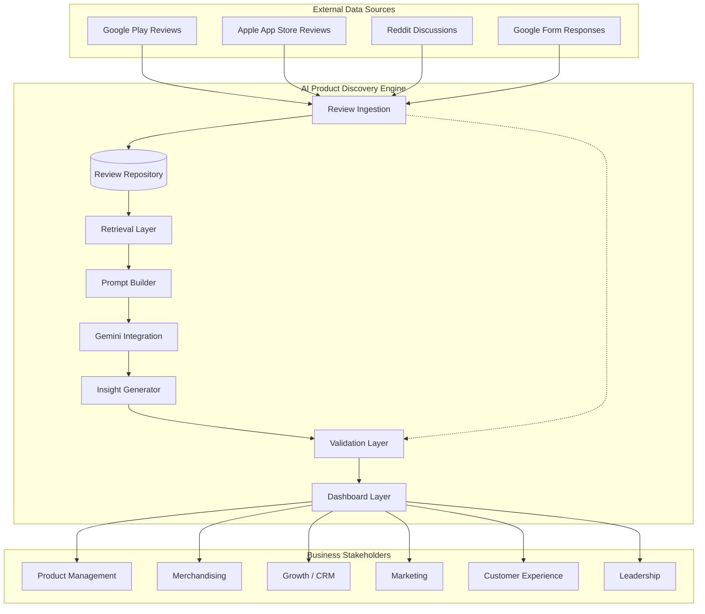

### 3.2 End-to-End Data Flow

```
Source → Connector → Normalize → Enrich/Tag → Validate (ingest) → Repository
                                                                    ↓
Stakeholder ← Dashboard ← Validate (output) ← Insight Generator ← Gemini ← Prompt Builder ← Retrieval
```

### 3.3 Processing Modes

| Mode | Trigger | Use Case |
|------|---------|----------|
| **Batch ingestion** | Scheduled (daily/weekly) | Play Store, App Store, Reddit crawl |
| **Event ingestion** | Form submission webhook or CSV drop | Google Form responses |
| **Ad-hoc analysis** | Analyst request via dashboard | Deep dive on RQ2 + category |
| **Scheduled synthesis** | Monthly cron | Monthly Discovery Intelligence Report |
| **Incremental update** | Post-ingestion | Refresh Q&A repository entries when new evidence crosses threshold |

### 3.4 Core Domain Entities

| Entity | Description |
|--------|-------------|
| **SourceDocument** | Atomic unit of user voice (review, comment, form response) |
| **EnrichmentRecord** | Tags: RQ, theme, sentiment, category, segment, journey stage, recency |
| **EvidenceBundle** | Retrieved documents + metadata assembled for a synthesis task |
| **InsightArtifact** | Structured output: card, profile, barrier map, opportunity, report |
| **AnalysisRun** | Audit record: prompts, model version, inputs, outputs, validation result |
| **TaxonomyMapping** | Blinkit category L1/L2 mapping for normalization |

---

## 4. Review Ingestion

The **Review Ingestion** subsystem acquires raw feedback from four source types and produces normalized, enriched documents ready for the Review Repository.

### 4.1 Component Architecture

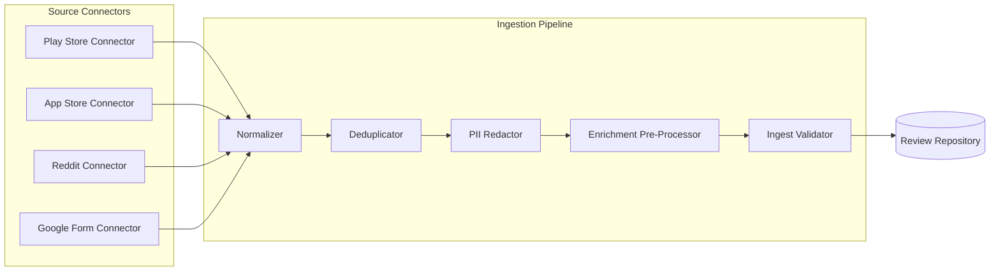

### 4.2 Source Connectors

| Connector | Input Method | Key Fields Extracted |
|-----------|--------------|----------------------|
| **Play Store Connector** | Public API / approved export | `review_id`, text, star_rating, date, app_version, helpful_count |
| **App Store Connector** | App Store Connect API / export | `review_id`, text, star_rating, date, app_version |
| **Reddit Connector** | Reddit API (PRAW or enterprise equivalent) | `post_id`, `comment_id`, text, subreddit, date, score, thread_title |
| **Google Form Connector** | Google Sheets API / CSV / webhook | `response_id`, Q&A pairs, submission_date, segment fields |

### 4.3 Normalization Schema

All sources map to a unified **Canonical Review Document (CRD)**:

```json
{
  "document_id": "uuid",
  "source_type": "play_store | app_store | reddit | google_form",
  "source_id": "native-id",
  "text": "normalized body",
  "title": "optional (reddit thread title)",
  "rating": "1-5 or null",
  "timestamp": "ISO-8601",
  "metadata": {
    "subreddit": "optional",
    "app_version": "optional",
    "form_question_id": "optional"
  },
  "ingestion_run_id": "uuid",
  "content_hash": "sha256"
}
```

### 4.4 Ingestion Pipeline Stages

| Stage | Function |
|-------|----------|
| **Normalize** | Encoding cleanup, language detection, whitespace/emoji handling |
| **Deduplicate** | Content-hash + source-id idempotency; skip unchanged re-ingests |
| **PII Redact** | Remove emails, phone numbers, addresses where detectable |
| **Enrich (pre)** | Rule-based keyword tagging for discovery signals; category mention extraction |
| **Ingest Validate** | Schema compliance, minimum text length, source allowlist, timestamp sanity |

### 4.5 Scheduling & Reliability

- **Orchestrator:** Apache Airflow or Cloud Composer (scheduled DAGs)
- **Retry policy:** Exponential backoff on connector failures; dead-letter queue for poison records
- **Idempotency:** Upsert by `(source_type, source_id)`; never duplicate documents
- **Lineage:** Every document tagged with `ingestion_run_id` and connector version

### 4.6 Discovery Signal Keywords (Pre-Enrichment)

Rule-based scanner flags documents containing discovery-relevant language for priority embedding and indexing:

`only order`, `variety`, `selection`, `found`, `discovered`, `wish they had`, `try new`, `category names`, competitor names (`Zepto`, `Instamart`, `BigBasket`), journey terms (`search`, `homepage`, `recommendation`, `deal`).

---

## 5. Review Repository

The **Review Repository** is the system of record for canonical documents, enrichments, embeddings metadata, and insight artifacts.

### 5.1 Storage Architecture

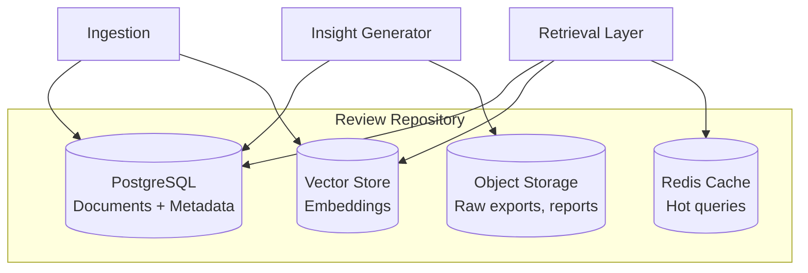

### 5.2 PostgreSQL — Relational Store

**Primary tables:**

| Table | Purpose |
|-------|---------|
| `source_documents` | CRD records; full text; source lineage |
| `enrichment_records` | RQ, theme, sentiment, category, segment, journey, recency tags |
| `taxonomy_mappings` | Raw term → Blinkit L1/L2 category |
| `insight_artifacts` | Generated cards, profiles, opportunities, reports (JSONB) |
| `analysis_runs` | Prompt hash, model version, input bundle IDs, validation status |
| `evidence_links` | insight_id → document_id (provenance graph) |
| `contradiction_log` | Conflicting themes with source pointers |

**Indexes:**

- `source_type`, `timestamp`, `theme`, `research_question`, `category_l1`
- Full-text search (PostgreSQL `tsvector`) for keyword fallback retrieval
- Composite index on `(research_question, recency_bucket, source_type)`

### 5.3 Vector Store

| Attribute | Specification |
|-----------|---------------|
| **Purpose** | Semantic similarity search over review text |
| **Embedding model** | `text-embedding-004` (Google) or equivalent dimension-compatible model |
| **Chunking** | Reddit long posts: split at 512 tokens with 64-token overlap; reviews: single chunk |
| **Metadata filters** | source_type, timestamp range, RQ tag, category, segment signal |
| **Candidate technology** | pgvector (co-located) or Vertex AI Vector Search |

### 5.4 Object Storage

- Raw connector exports (audit / reprocessing)
- Generated PDF/CSV report exports
- Prompt templates version snapshots

### 5.5 Data Retention & Versioning

| Policy | Setting |
|--------|---------|
| Source documents | Retain indefinitely; soft-delete only |
| Analysis runs | Retain 24 months minimum |
| Insight artifacts | Versioned; superseded insights marked, not deleted |
| Taxonomy | Version-tagged; insights reference `taxonomy_version` |

---

## 6. Retrieval Layer

The **Retrieval Layer** assembles **Evidence Bundles**—the minimum relevant, diverse, recency-weighted set of documents for a given synthesis task.

### 6.1 Retrieval Architecture

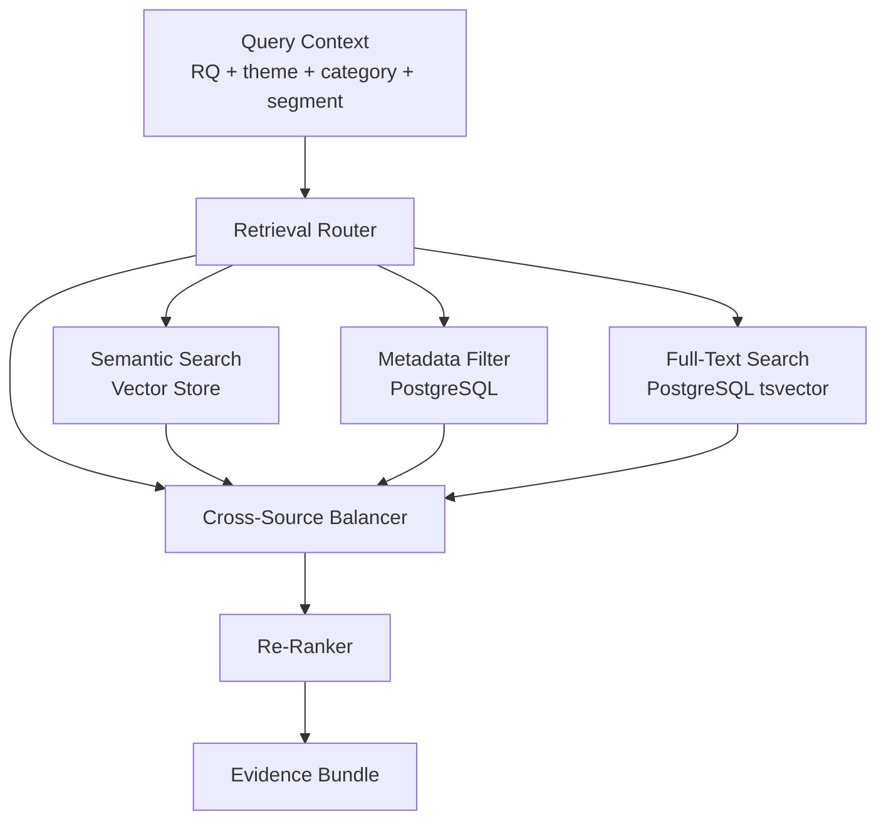

### 6.2 Query Context Object

```json
{
  "research_question": "RQ2",
  "themes": ["trust_quality", "substitution_fear"],
  "categories": ["Fresh Produce"],
  "segments": ["mission_shopper"],
  "source_types": ["play_store", "reddit"],
  "recency_window_days": 180,
  "min_sources": 2,
  "max_documents": 40
}
```

### 6.3 Retrieval Strategies

| Strategy | When Used | Behavior |
|----------|-----------|----------|
| **Semantic KNN** | Thematic deep dives | Top-K by embedding similarity to query embedding |
| **Metadata-first** | Scheduled RQ reports | Filter by RQ tag + recency, then semantic rank within |
| **Cross-source balancing** | High-confidence synthesis | Ensure ≥N documents from ≥2 source types before returning |
| **Contradiction fetch** | Root-cause / validation | Explicitly retrieve opposing-sentiment documents on same theme |
| **Form anchor** | Segment profiling | Prioritize structured Google Form responses for segment signals |

### 6.4 Re-Ranking Criteria

Documents scored by weighted composite:

1. **Semantic relevance** (0.35)
2. **Recency** (0.25) — exponential decay; boost last 90 days
3. **Source diversity bonus** (0.20)
4. **Discovery signal density** (0.10) — keyword pre-enrichment score
5. **Rating extremity** (0.10) — optional; surface strong sentiment

### 6.5 Evidence Bundle Output

Each bundle includes:

- Ordered list of `document_id`, excerpt (max 300 chars), source tag, timestamp
- Bundle metadata: source type distribution, recency histogram, theme coverage
- `bundle_id` for audit linkage to AnalysisRun

### 6.6 Caching

Redis caches frequent bundles (e.g., monthly RQ1 baseline) with TTL aligned to ingestion cycle; invalidated on new ingestion batch completion.

---

## 7. Prompt Builder

The **Prompt Builder** constructs **grounded, versioned prompts** that inject business context, retrieval results, and output schemas before Gemini invocation.

### 7.1 Prompt Assembly Pipeline

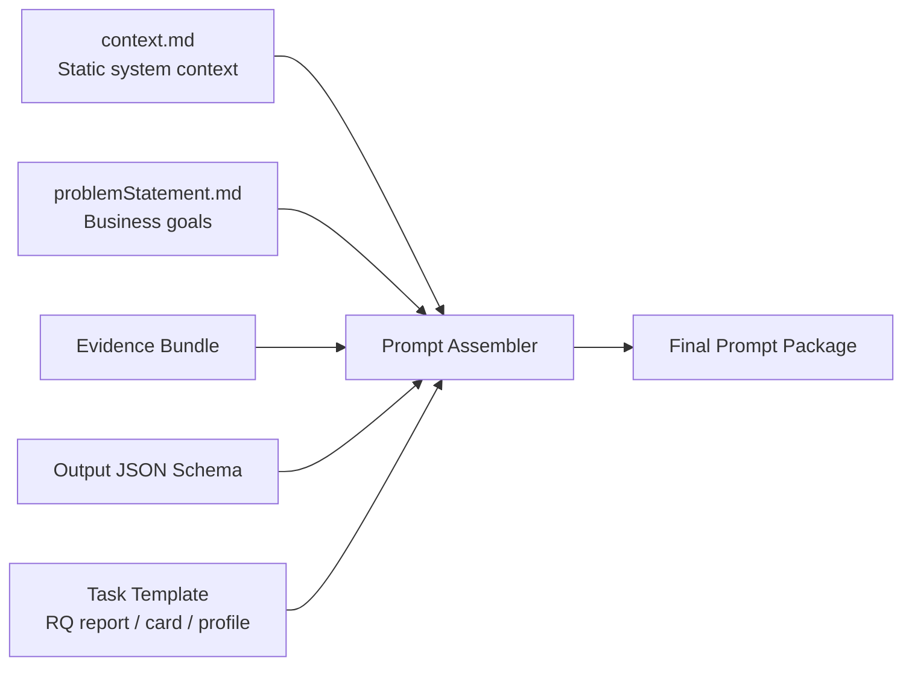

### 7.2 Prompt Package Structure

| Section | Content |
|---------|---------|
| **System instruction** | Role: Blinkit Discovery Intelligence analyst; constraints from `context.md` |
| **Business grounding** | North-star metric, hypotheses, segment definitions |
| **Task specification** | RQ mapping, analysis dimensions, confidence rules |
| **Evidence block** | Numbered excerpts with `[Play Store]` tags and document IDs |
| **Output schema** | JSON schema for Insight Card, Profile, Report section, etc. |
| **Negative constraints** | No fabricated quotes; distinguish observation vs. inference; flag contradictions |

### 7.3 Task Templates

| Template ID | Purpose | Typical Token Budget |
|-------------|---------|---------------------|
| `TPL-RQ-SYNTHESIS` | Answer one research question | 8K–16K input |
| `TPL-THEME-EXTRACT` | Batch theme tagging during enrichment | 4K input |
| `TPL-INSIGHT-CARD` | Single thematic insight card | 6K input |
| `TPL-SEGMENT-PROFILE` | Segment exploration profile | 8K input |
| `TPL-ROOT-CAUSE` | Symptom → cause tree | 12K input |
| `TPL-MONTHLY-REPORT` | Full monthly intelligence report | 24K–32K input (multi-pass) |
| `TPL-OPPORTUNITY` | Opportunity backlog item generation | 6K input |

### 7.4 Multi-Pass Strategy (Large Reports)

Monthly report generation uses orchestrated passes:

1. **Pass A:** Per-RQ mini-synthesis (7 parallel calls)
2. **Pass B:** Cross-RQ contradiction and theme consolidation
3. **Pass C:** Executive narrative + opportunity prioritization

Each pass receives only relevant evidence bundles (retrieval-scoped).

### 7.5 Prompt Versioning

- Templates stored in Git-backed registry (`prompts/v{semver}/`)
- `prompt_hash` recorded in `analysis_runs` for reproducibility
- A/B evaluation of prompt changes via Validation Layer quality scores

---

## 8. Gemini Integration

The **Gemini Integration** layer manages all interactions with Google Gemini models via Vertex AI (enterprise) or Google AI Studio (development).

### 8.1 Integration Architecture

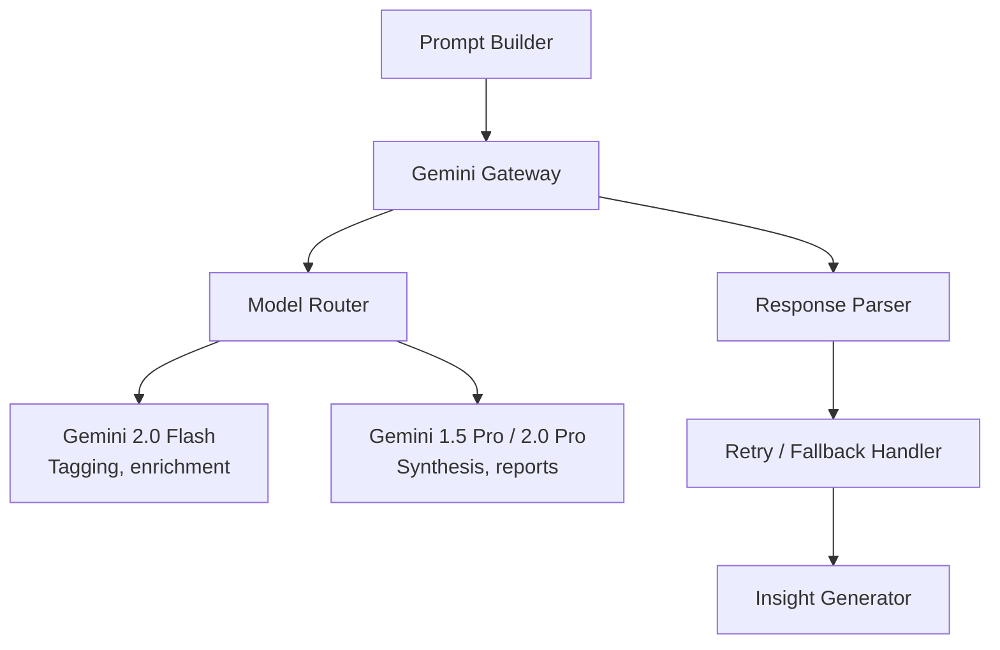

### 8.2 Model Routing Policy

| Task Type | Model | Parameters |
|-----------|-------|------------|
| Theme tagging, sentiment, segment signal extraction | **Gemini 2.0 Flash** | Low temperature (0.1), JSON mode |
| Insight cards, segment profiles, opportunities | **Gemini 1.5 Pro** | Temperature 0.2, JSON mode |
| Root-cause trees, cross-source synthesis | **Gemini 1.5 Pro** | Temperature 0.2, structured output |
| Monthly Discovery Intelligence Report | **Gemini 1.5 Pro** (multi-pass) | Temperature 0.3, section schemas |

### 8.3 API Contract

```python
# Conceptual interface (not implementation deliverable)
GeminiRequest(
    model: str,
    system_instruction: str,
    contents: list[ContentBlock],
    response_schema: JSONSchema | None,
    temperature: float,
    max_output_tokens: int,
    safety_settings: SafetyConfig
) -> GeminiResponse(
    text: str,
    parsed_json: dict | None,
    usage: TokenUsage,
    model_version: str,
    latency_ms: int
)
```

### 8.4 Structured Output

All synthesis tasks use **JSON schema constrained generation** (`response_schema`) matching Insight Artifact definitions from `context.md`:

- Thematic Insight Card
- Segment Exploration Profile
- Barrier Map node
- Root-Cause Tree node
- Opportunity Backlog Item
- Monthly Report section

### 8.5 Reliability & Cost Controls

| Control | Implementation |
|---------|----------------|
| **Rate limiting** | Token bucket per minute; queue excess requests |
| **Retry** | 3 retries with jitter on 429/503 |
| **Fallback** | Flash → Pro downgrade only for non-synthesis tasks; synthesis failures alert ops |
| **Token budget** | Hard cap per analysis run; truncate evidence with priority ranking |
| **Caching** | Optional Gemini context cache for static system instructions |
| **Secrets** | API keys in GCP Secret Manager; workload identity in production |

### 8.6 Safety & Policy

- Gemini safety filters enabled; log blocked responses
- Custom post-filter: reject outputs containing fabricated `[Play Store]` quotes not in evidence bundle
- No PII in prompts (redacted at ingestion)

---

## 9. Insight Generator

The **Insight Generator** transforms validated Gemini responses into persistent, linked business artifacts stored in the Review Repository and served to the Dashboard.

### 9.1 Generator Architecture

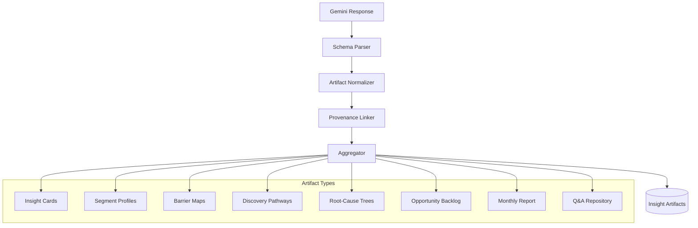

### 9.2 Generation Workflows

| Workflow | Input | Output |
|----------|-------|--------|
| **WF-ENRICH** | New documents post-ingestion | EnrichmentRecords (RQ, theme, sentiment, etc.) |
| **WF-THEME-DISCOVER** | Weekly batch | New/updated Insight Cards |
| **WF-RQ-UPDATE** | RQ + evidence bundle | Q&A Repository entry (versioned) |
| **WF-SEGMENT-BUILD** | Segment query + bundle | Segment Exploration Profile |
| **WF-OPPORTUNITY-MINE** | Cross-theme aggregation | Ranked Opportunity Backlog items |
| **WF-MONTHLY-REPORT** | Scheduled multi-pass | Monthly Discovery Intelligence Report |
| **WF-CONTRADICTION-SCAN** | Theme pairs | Contradiction log entries |

### 9.3 Provenance Linker

For every claim in an insight:

1. Extract cited `document_id` references from Gemini output
2. Verify each ID exists in evidence bundle
3. Write `evidence_links` rows: `(insight_id, document_id, excerpt, claim_text)`
4. Reject insight if >20% of citations fail verification (configurable)

### 9.4 Aggregation Rules

| Rule | Behavior |
|------|----------|
| **Theme merge** | Same theme label + same RQ within 7 days → update existing card, increment evidence count |
| **Trend detection** | Compare mention frequency vs. prior 30/90-day window → tag `new / rising / stable / declining` |
| **Confidence elevation** | Auto-upgrade to High only when cross-source rule satisfied in linker verification |
| **Opportunity ranking** | Score = impact_tier weight × evidence density × segment addressability |

### 9.5 Q&A Repository

Persistent store of RQ1–RQ7 answers:

```json
{
  "research_question": "RQ2",
  "answer_summary": "...",
  "evidence_count": 47,
  "source_distribution": {"play_store": 20, "reddit": 15, "app_store": 8, "google_form": 4},
  "confidence": "High",
  "last_updated": "2026-07-29",
  "version": 3,
  "linked_insights": ["insight-uuid-1", "insight-uuid-2"]
}
```

---

## 10. Validation Layer

The **Validation Layer** is a cross-cutting quality gate applied at **ingestion**, **post-Gemini**, and **pre-dashboard publish**.

### 10.1 Validation Architecture

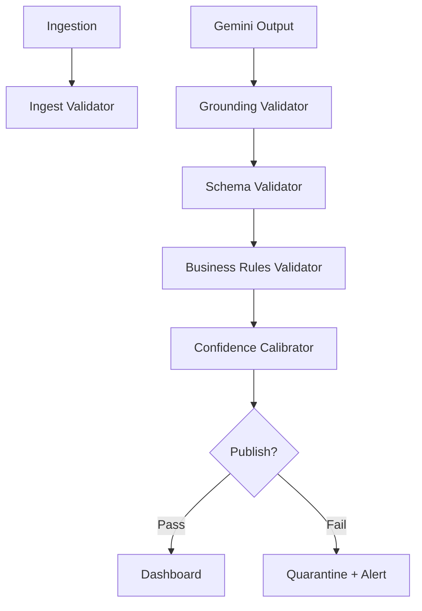

### 10.2 Validation Stages

#### Stage 1 — Ingest Validator

| Check | Rule |
|-------|------|
| Schema | CRD required fields present |
| Source allowlist | Only play_store, app_store, reddit, google_form |
| Text quality | Minimum 10 characters; not spam/gibberish |
| PII | No unredacted email/phone patterns |

#### Stage 2 — Grounding Validator

| Check | Rule |
|-------|------|
| Citation existence | Every quoted document_id in evidence bundle |
| Quote fidelity | Fuzzy match ≥85% between claimed quote and source text |
| Fabrication block | Reject insights with uncited direct quotes |

#### Stage 3 — Schema Validator

| Check | Rule |
|-------|------|
| JSON schema | Matches artifact type schema |
| Required fields | Theme, RQ, confidence, segments, categories per `context.md` |
| Enum values | Confidence ∈ {High, Medium, Low}; impact ∈ {High, Medium, Low} |

#### Stage 4 — Business Rules Validator

| Check | Rule |
|-------|------|
| RQ mapping | Every insight maps to RQ1–RQ7 |
| High-confidence rule | High requires ≥2 source types in evidence links |
| Actionability | Opportunity items must have action_owner |
| Anti-pattern block | Reject generic "improve UX" without segment + category |
| North-star linkage | Monthly report must include metric narrative section |
| Bias disclosure | Reports must include representativeness caveat |

#### Stage 5 — Confidence Calibrator

Deterministic override of model-assigned confidence:

```
IF source_types < 2 AND confidence == High → downgrade to Medium
IF evidence_count < 3 AND confidence == High → downgrade to Medium
IF recency > 180d majority AND confidence == High → add stale_data flag
IF contradiction_detected → cap confidence at Medium; add to contradiction_log
```

### 10.3 Quarantine & Human Review

Failed artifacts routed to **Analyst Review Queue**:

- Grounding failures → fix evidence bundle and regenerate
- Schema failures → auto-retry once with repair prompt
- Business rule failures → human edit or reject

### 10.4 Validation Metrics

| Metric | Target |
|--------|--------|
| Grounding pass rate | ≥95% after one retry |
| High-confidence precision (human audit sample) | ≥90% |
| Citation verification latency | <200ms per insight |
| Quarantine rate | <10% of generated artifacts |

---

## 11. Dashboard Layer

The **Dashboard Layer** provides stakeholder-facing access to insights, source drill-down, and export capabilities.

### 11.1 Dashboard Architecture

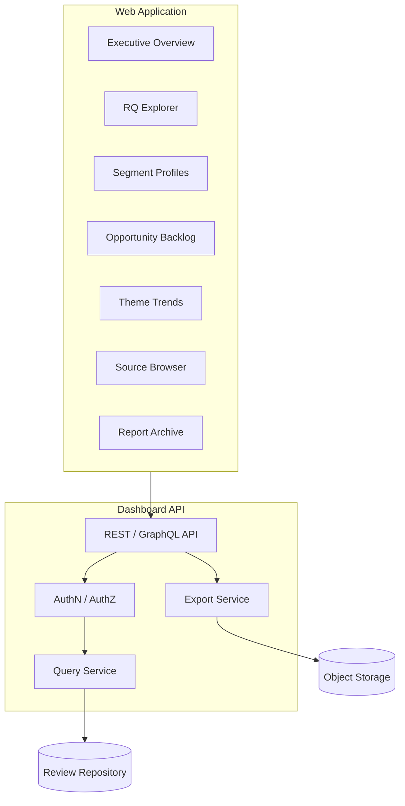

### 11.2 Primary Views

| View | Audience | Features |
|------|----------|----------|
| **Executive Overview** | Leadership | North-star narrative, top 5 themes, trend sparklines, contradiction alerts |
| **RQ Explorer** | Product, Research | RQ1–RQ7 answers, evidence count, confidence, source mix, version history |
| **Theme Trends** | All stakeholders | Theme frequency over time; new/rising/stable/declining badges |
| **Segment Profiles** | Growth, Marketing | Exploration likelihood, barriers, channels, verbatim examples |
| **Opportunity Backlog** | Merchandising, Product | Ranked table; filter by segment, category, impact tier; export CSV |
| **Barrier & Pathway Maps** | Product, CX | Visual journey maps; severity; drop-off stages |
| **Source Browser** | Analysts | Full-text search; filter by source, date, category; never show PII |
| **Report Archive** | All | Monthly Discovery Intelligence Reports; PDF download |
| **Analyst Queue** | Internal | Quarantined insights pending review |

### 11.3 Key Interactions

- **Evidence drill-down:** Click any insight claim → see linked source documents with highlights
- **Contradiction view:** Side-by-side opposing evidence for contested themes
- **Ad-hoc analysis trigger:** Select RQ + filters → enqueue retrieval + Gemini synthesis run
- **Export:** PDF report, CSV opportunity backlog, JSON insight bundle

### 11.4 Access Control

| Role | Permissions |
|------|-------------|
| **Viewer** | Read published insights and reports |
| **Analyst** | Trigger ad-hoc runs; manage quarantine queue |
| **Admin** | Prompt template access, taxonomy edits, user management |
| **Executive** | Viewer + executive summary email subscriptions |

Authentication via corporate SSO (Google Workspace / Okta); RBAC enforced at API layer.

---

## 12. Deployment Architecture

### 12.1 Environment Topology

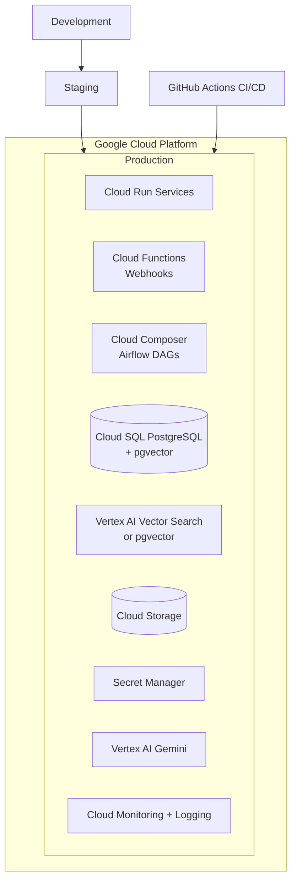

### 12.2 Service Deployment Map

| Service | Deployment Target | Scaling |
|---------|-------------------|---------|
| Review Ingestion workers | Cloud Composer + Cloud Run Jobs | Batch; scale on queue depth |
| Retrieval API | Cloud Run | Auto-scale 0–N |
| Prompt Builder + Gemini Gateway | Cloud Run | Auto-scale; concurrency limits |
| Insight Generator | Cloud Run Jobs | Batch post-Gemini |
| Validation Service | Cloud Run (sidecar pattern) | Sync with generator |
| Dashboard API | Cloud Run | Auto-scale |
| Dashboard Frontend | Firebase Hosting or Cloud Run (Next.js) | CDN-backed static |

### 12.3 Network & Security

| Control | Implementation |
|---------|----------------|
| **Network** | Private VPC; Cloud SQL private IP; no public DB access |
| **Secrets** | Secret Manager for Gemini API, Reddit credentials, DB passwords |
| **IAM** | Least-privilege service accounts per microservice |
| **Encryption** | TLS in transit; AES-256 at rest (GCS, Cloud SQL) |
| **Audit** | Cloud Audit Logs for admin actions; analysis_runs for AI audit |

### 12.4 CI/CD Pipeline

```
Push → Lint/Test → Build container → Deploy staging → Integration tests
     → Manual approval → Deploy production → Smoke test → Notify
```

- Infrastructure as Code: Terraform
- Container registry: Artifact Registry
- Blue/green or rolling deploy for Cloud Run services

### 12.5 Observability

| Signal | Tool | Key Alerts |
|--------|------|------------|
| Logs | Cloud Logging | Ingestion failures, Gemini 429/503 spikes |
| Metrics | Cloud Monitoring | Ingestion lag, retrieval latency p95, validation fail rate |
| Traces | Cloud Trace | End-to-end analysis run duration |
| Cost | GCP Billing + custom dashboards | Gemini token spend per report cycle |

### 12.6 Disaster Recovery

| Component | RPO | RTO | Strategy |
|-----------|-----|-----|----------|
| PostgreSQL | 1 hour | 4 hours | Automated backups + point-in-time recovery |
| Vector index | 24 hours | 8 hours | Rebuild from PostgreSQL + re-embed job |
| Object storage | 0 | 1 hour | Multi-region bucket |
| Insight artifacts | 0 | 1 hour | Replicated in PostgreSQL JSONB |

---

## 13. Technology Stack

### 13.1 Recommended Stack Summary

| Layer | Technology | Justification |
|-------|------------|---------------|
| **Language** | Python 3.11+ | ML/AI ecosystem, Gemini SDK maturity |
| **API framework** | FastAPI | Async, OpenAPI, type hints |
| **Frontend** | Next.js 14 + TypeScript | SSR, component ecosystem, enterprise adoption |
| **UI components** | shadcn/ui + Tailwind CSS | Accessible, customizable dashboard UI |
| **Orchestration** | Apache Airflow (Cloud Composer) | Batch ingestion, scheduled reports |
| **Primary database** | PostgreSQL 15 + pgvector | Relational + vector co-location; ACID for provenance |
| **Vector search** | pgvector (Phase 1) → Vertex AI Vector Search (Phase 2 scale) | Start simple; migrate at volume threshold |
| **Cache** | Redis (Memorystore) | Retrieval bundle cache, rate limit counters |
| **Object storage** | Google Cloud Storage | Raw exports, report PDFs |
| **LLM** | Google Gemini via Vertex AI | Native GCP integration; Flash + Pro routing |
| **Embeddings** | Google text-embedding-004 | Consistent with Gemini ecosystem |
| **Reddit ingestion** | PRAW + Reddit API | Standard Python Reddit client |
| **Forms ingestion** | Google Sheets API / Apps Script webhook | Native Google Form integration |
| **App reviews** | google-play-scraper / App Store Connect API | Established connectors |
| **Validation** | Pydantic v2 + custom rules engine | Schema + business rule enforcement |
| **Auth** | Google Identity / OAuth 2.0 + RBAC | Enterprise SSO alignment |
| **IaC** | Terraform | Reproducible GCP provisioning |
| **CI/CD** | GitHub Actions | Standard pipeline automation |
| **Monitoring** | Cloud Monitoring, Cloud Logging, Cloud Trace | Native GCP observability |

### 13.2 Integration Matrix

| System | Protocol | Direction |
|--------|----------|-----------|
| Google Play | REST / scraper library | Inbound |
| Apple App Store | REST (App Store Connect) | Inbound |
| Reddit | OAuth REST (PRAW) | Inbound |
| Google Forms | Sheets API / webhook | Inbound |
| Vertex AI Gemini | gRPC/REST (google-genai SDK) | Outbound |
| Vertex AI Embeddings | REST | Outbound |
| Corporate SSO | OAuth 2.0 / SAML | Inbound (auth) |
| Email (optional) | SendGrid / GCP | Outbound (report delivery) |

### 13.3 Development vs. Production

| Concern | Development | Production |
|---------|-------------|------------|
| Gemini | AI Studio API key | Vertex AI with workload identity |
| Database | Local PostgreSQL + Docker Compose | Cloud SQL HA instance |
| Vector store | pgvector local | pgvector on Cloud SQL or Vertex Vector Search |
| Dashboard | localhost:3000 | Firebase Hosting + Cloud Run API |
| Ingestion | Manual CSV / sample datasets | Scheduled Composer DAGs |

---

## 14. Future Scope

Items below are **explicitly out of Phase 1** but architecturally anticipated.

### 14.1 Data Source Expansion

| Enhancement | Business Value |
|-------------|----------------|
| Twitter/X and Instagram mentions | Broader social discovery narratives |
| In-app NPS / CSAT surveys | First-party structured feedback at scale |
| App store review replies (Blinkit responses) | Close-loop on frustration themes |
| Hindi and regional language ingestion | Reduce English-only bias |
| Customer support ticket summaries (de-identified) | High-friction discovery blockers |

### 14.2 Analytics Integration

| Enhancement | Business Value |
|-------------|----------------|
| Read-only connector to Blinkit Analytics (MAC, category breadth) | Quantitative + qualitative joint narratives |
| Insight → metric correlation dashboard | Validate whether acted-on opportunities moved north-star |
| Cohort overlay | Attach segment profiles to real behavioral cohorts |

### 14.3 AI Capability Enhancements

| Enhancement | Description |
|-------------|-------------|
| **Automated contradiction resolution workflows** | Guided re-retrieval when conflicting evidence detected |
| **Fine-tuned theme classifier** | Reduce Gemini calls for enrichment; lower cost |
| **Multi-modal analysis** | Screenshot reviews mentioning UI discovery flows |
| **Agentic deep-dive** | Autonomous multi-step retrieval when initial bundle insufficient |
| **Human feedback loop (RLHF-lite)** | Analyst thumbs-up/down retrains ranking weights |

### 14.4 Product Integration (Downstream)

| Enhancement | Description |
|-------------|-------------|
| Insight API for internal tools | Jira/Linear ticket auto-population with evidence |
| Slack digest bot | Weekly theme digest to stakeholder channels |
| Merchandising feed | Category opportunity flags to assortment planning tools |
| **Not in scope:** Real-time recommendation model training | Insights inform; do not serve |

### 14.5 Platform Maturity

| Enhancement | Description |
|-------------|-------------|
| Multi-tenant architecture | Support other brands/business units |
| Feature store for enrichment tags | Reuse tags across Blinkit AI products |
| Formal data catalog (Dataplex) | Enterprise data governance |
| SOC 2 / ISO audit trail enhancements | Extended retention and access logging |
| Cost optimization | Embedding cache warming; speculative Flash pre-screen before Pro synthesis |

### 14.6 Phase Roadmap

| Phase | Timeline | Scope |
|-------|----------|-------|
| **Phase 1 — Foundation** | Months 1–2 | Ingestion (4 sources), repository, retrieval, Gemini synthesis, basic dashboard |
| **Phase 2 — Quality & Scale** | Months 3–4 | Validation layer hardening, monthly report automation, RBAC, observability |
| **Phase 3 — Intelligence Maturity** | Months 5–6 | Trend detection, contradiction workflows, Q&A repository, analyst queue |
| **Phase 4 — Ecosystem** | Month 7+ | Analytics integration, language expansion, Slack/API exports, optional vector migration |

---

## Appendix A — Analysis Run Sequence Diagram

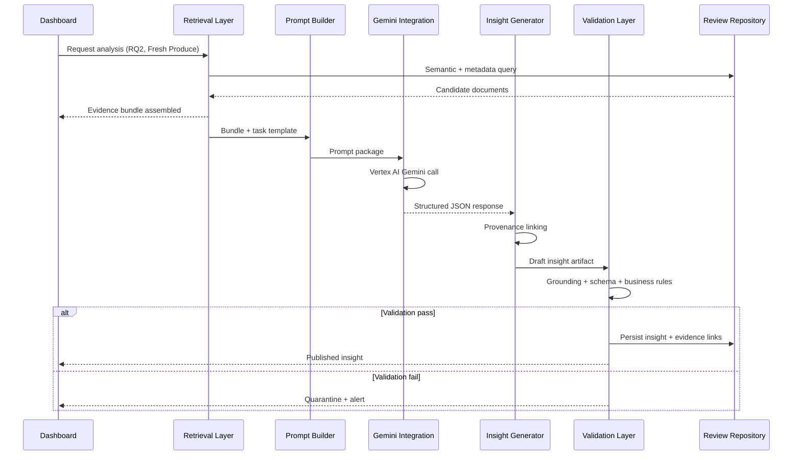

---

## Appendix B — Document Relationships

| Document | Role |
|----------|------|
| `problemStatement.md` | Business problem, north-star metric, stakeholder map |
| `context.md` | AI operating context, RQ framework, output schemas, evaluation criteria |
| `architecture.md` (this file) | Technical solution design and deployment specification |

---

## Appendix C — Glossary

| Term | Definition |
|------|------------|
| **CRD** | Canonical Review Document — unified ingestion schema |
| **Evidence Bundle** | Retrieval output: ranked documents for a synthesis task |
| **Analysis Run** | Auditable record of one end-to-end AI synthesis execution |
| **Insight Artifact** | Structured business output stored and served via dashboard |
| **Grounding** | Verification that AI claims cite real source documents |
| **Triangulation** | Confirmation of a theme across ≥2 independent source types |

---

*This architecture supports the Blinkit AI Product Discovery Engine: ingest user voice, retrieve evidence, synthesize with Gemini, validate rigorously, and deliver actionable category exploration intelligence to business teams.*
